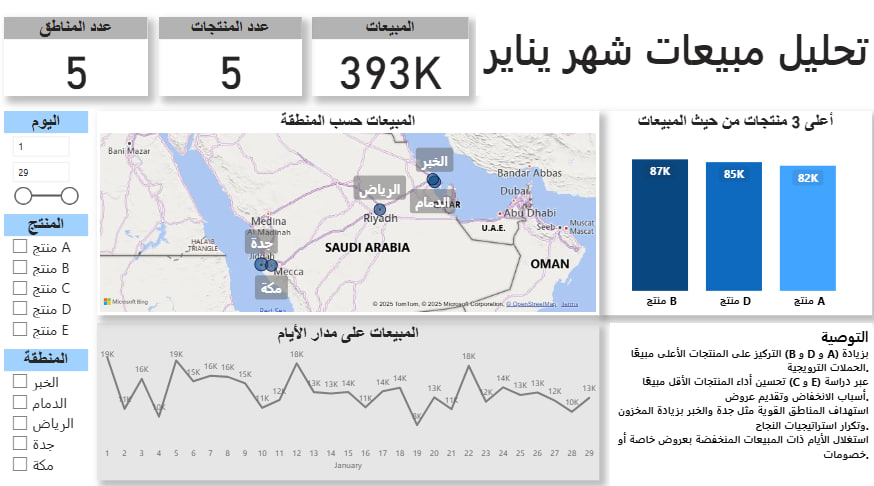

# 📊 Sales Analysis - January

## 📝 Project Overview
This project provides an **analysis of sales performance for January** using **Power BI**.  
The dashboard gives insights into sales distribution across regions, product performance, and daily trends.  
The goal is to identify best-selling products, low-performing ones, and provide recommendations for improvement.

---

## 📂 Project Files
- **Dashboard.jpg** → Screenshot of the interactive Power BI dashboard.  
- **Dataset.xlsx** → Raw dataset used for the analysis.  
- **Sales Analysis.pbix** → Power BI report file.  
- **README.md** → Documentation of the project.  

---

## 📊 Dashboard Insights
1. **Key Metrics**
   - Total Sales: **407K**
   - Number of Products: **5**
   - Number of Regions: **5**

2. **Top 3 Products by Sales**
   - Product D → 88K  
   - Product B → 87K  
   - Product A → 84K  

3. **Sales by Region**
   - Highest sales observed in **Al Khobar, Riyadh, and Dammam**.  

4. **Sales Trend**
   - Sales fluctuate daily between **11K – 19K** with noticeable peaks at the beginning of the month.

---

## ✅ Recommendations
- Focus marketing efforts on top-performing products (**A, B, D**) to maximize revenue.  
- Improve visibility and promotions for low-performing products (**C, E**).  
- Expand distribution in high-demand regions like **Al Khobar, Riyadh, and Dammam**.  
- Apply targeted campaigns during peak sales periods to boost performance further.  
- Monitor underperforming areas and explore localized strategies.  

---

## 🛠️ Tools & Technologies
- **Power BI** → Dashboard & Data Visualization  
- **Excel** → Data preparation  

---

## 🚀 How to Use
1. Open the dataset (**Dataset.xlsx**) for raw data.  
2. Open the Power BI file (**Sales Analysis.pbix**) to explore the interactive report.  
3. Refer to **Dashboard.jpg** for a quick preview of the analysis.  

---

## 📌 Conclusion
The analysis provides clear visibility into product and regional performance.  
By applying the given recommendations, sales can be optimized and resources allocated more effectively.



```
