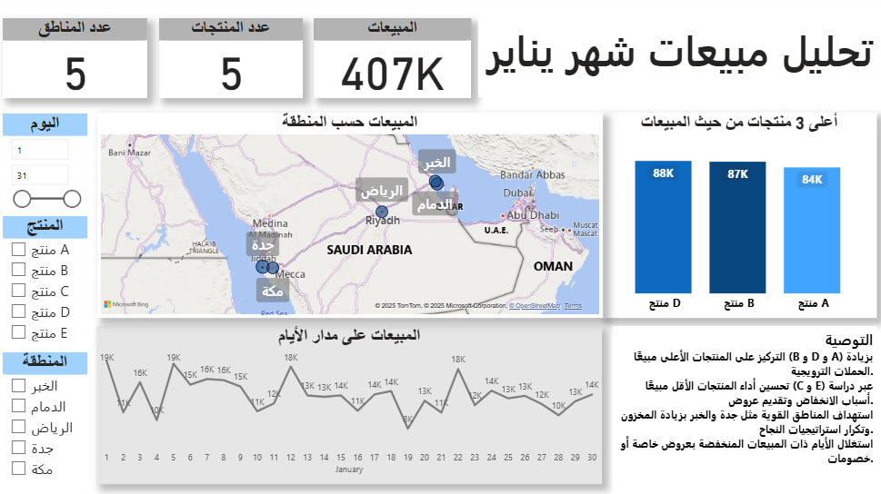

# Sales Data Analysis – January 📊

## Overview

This project analyzes **January sales data** using **Power BI**, with the goal of identifying top-performing products, tracking revenue trends, and providing actionable recommendations to improve business performance.

The dataset includes:

* **Date**
* **Product**
* **Region**
* **Revenue**

---

## Dashboard Highlights

1. **KPIs (Key Performance Indicators):**

   * Total Sales: **393K**
   * Number of Products: **5**
   * Number of Regions: **5**

2. **Top 3 Products by Sales:**

   * Product B: **87K**
   * Product D: **85K**
   * Product A: **82K**

3. **Sales by Region:**

   * Visualized using an interactive **map** to show geographic distribution.

4. **Sales Over Time:**

   * Daily revenue trend to track fluctuations across January.

---

## Recommendations 💡

* **Boost sales of top products (B, D, A):** Focus marketing and promotions on products already performing well.
* **Support low-performing products:** Evaluate weak products and design targeted offers to increase their sales.
* **Leverage regional insights:** Repeat successful campaigns in strong-performing regions and target weaker areas with localized promotions.
* **Seasonality planning:** Use daily sales trend to plan campaigns around peak and low-demand days.

---

## Tools Used 🛠️

* **Power BI** for data visualization and dashboard building.
* **Excel/CSV** as the data source.

---

## How to Use

1. Clone this repository.
2. Open the `.pbix` file in **Power BI Desktop**.
3. Explore the dashboard interactively using slicers (by date, product, and region).

---

## Live Dashboard 🌐
📊 [Download Power BI Dashboard (.pbix)](تحليل%20بيانات%20مبيعات.pbix)  

